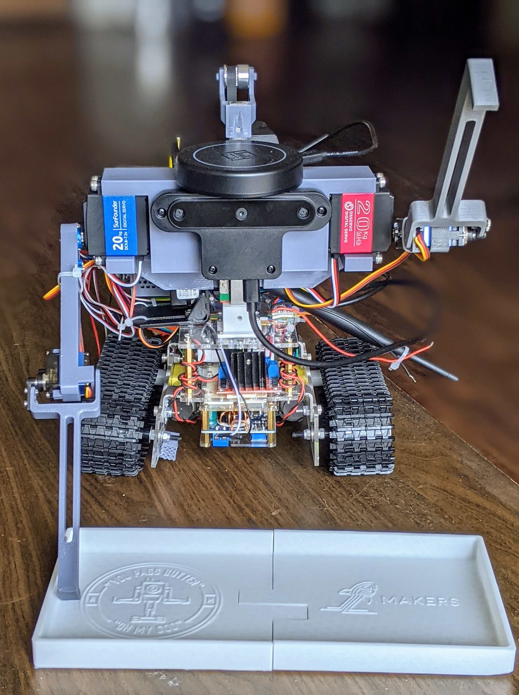

The purpose of thie project is to build a robot which is capable of locating different people at a dinner table and passing butter to them when commanded. This is an idea made popular by a scene from Ricky and Morty.

[Here's our showcase video](https://youtu.be/vPM-rD34ycs?t=3011) describing the project, its purpose, its design, and the current state of affairs as of Spring 2021.

Full documentation can be found [here](docs/). This includes the original project plan (before work began), the bill of materials, the mechanical designs used for 3D printing, and the electronics schematics used for wiring. Electronics designs were made in [fritzing](https://fritzing.org/)



# Setup

*The current version of this code expects ROS Melodic (Ubuntu 18.04) on a Jetson Nano 4GB. Many of the components will work on other platforms, but your mileage may vary, especially for things like circuit python.*

1. Wire everything up. [(See Jetson Nano pinout)](https://www.jetsonhacks.com/nvidia-jetson-nano-j41-header-pinout/)
1. [Ensure python/ROS can access your USB devices](https://askubuntu.com/questions/595896/how-to-allow-software-access-to-any-usb-devices) without admin permissions. [This may also help](https://askubuntu.com/questions/595896/how-to-allow-software-access-to-any-usb-devices).
1. [Setup circuit python on the Jetson Nano](https://learn.adafruit.com/circuitpython-libraries-on-linux-and-the-nvidia-jetson-nano/initial-setup)
1. Install ROS Melodic
1. Install pyaudio:
```bash
sudo apt-get install libasound-dev portaudio19-dev libportaudio2 libportaudiocpp0
sudo apt-get install ffmpeg libav-tools
sudo python3 -m pip install pyaudio
```
1. Clone this repo to your ROS catkin_ws/src directory. 
1. `python3 -m pip install -r requirements.txt`
1. If using the wake word functionality, also do: `python3 -m pip install -r src/pass_butter/VoiceCommands/requirements.txt`
1. [Install the arduino rosserial package.](arduino/README.MD)
1. [Setup ROS for python3.](https://medium.com/@beta_b0t/how-to-setup-ros-with-python-3-44a69ca36674)
1. Build the pass_butter package with `catkin_make` or `catkin build`.

# Usage

The robot can be run in a few different ways right now, many at the same time as long as they do not use the same hardware. Take a look at the launch files and nodes especially. There remains some work to integrate all of this functionality into one or two scripts.

* If you would like to move the base around, then run this first (have it working in the background in addition to other nodes you launch): `roslaunch pass_butter arduino.launch` 
* To make the robot follow the direction of your voice run this: `rosrun pass_butter doa.py`
* To run the sequence of commands that was used for the demo video, call this `roslaunch pass_butter butter.launch`
* To view the URDF of the robot, run this: `roslaunch pass_butter rviz.launch`
* To make the robot respond to "computer" and play some response, run: `rosrun passbutter src/pass_butter/VoiceCommands/main.py --keywords computer`
* To get an interactive terminal for sending the robot commands, run this: `rosrun pass_butter demo.py`
  * 'u' - put arms up
  * 'd' - put arms down
  * 'w' - wave arms
  * 's#' - replace # with 0-4 to play different sounds
  * 'r###' - rotate the robot some amount, replace ### with a positive/negative decimal number
  * '###' - move forward or backward some amount, replace ### with a positive/negative decimal number
  * 'x' - exit/finish


## References

DOA: https://wiki.seeedstudio.com/ReSpeaker-USB-Mic-Array/#doa-direction-of-arrival


URDF: https://discourse.ros.org/t/fusion-360-add-in-to-export-urdf/6944
# Project Status

*Where does the project stand right now?*

## The Good 

1. The robot is fully assembled; the drive motors and arms are all functional. 
1. The robot has a working PID controller which is handled by an Arduino that communicates over ROS to the Jetson Nano.
1. The robot has a sense of wheel rotations and velocity thanks to the motor encoders
1. The robot can follow voice direction accurately using the directional microphone
1. The robot can respond to simple keywords such as "computer"

## The "Could Be Better"

1. Vertical head movement is non-functional. The stepper motor solution did not have enough torque to lift the relatively heavy head. The stepper motor is too weak. A worm gear motor would probably work much better with less hassle (stepper drivers can be annoying to setup).
1. The base is broken in multiple places and had to be glued back together on multiple occasions. The electronics hang off back of the base, and the base is bowing in the middle under the weight. A redesign of the base would be advisable to make it sturdier and to better fit all components.
1. The wiring is all done using a collection of breadboards and premade pcbs. This has led to some accidental short circuits of power wires. It would be much cleaner if it was all integrated to one main PCB.
1. We have an URDF to model the robot, but we do not yet have it integrated with the ROS transform system yet(e.g. [tf2](http://wiki.ros.org/tf2)) in order to view robot movement in rviz in real-time.
1. The arms do not have inverse kinematics setup--currently we work off of set points and known ranges of movement. Some calibration step would be useful too.
1. The arms can only pull or push, not grasp; more complex/useful arms would be interesting.
1. Full autonomy (obstacle avoidance, path planning) has not yet been setup/included in the software stack. The camera is currently not used.
1. Voice interaction is currently limited to wake words and does not make use of [dialogue/interaction systems](https://github.com/interaction-lab/HARMONI) which could provide much richer interactions without too much work.

# Contributors

 The project was led by a group of fantastic people who did a good amount of work in their spare time during a single semester. They are:

 * Anaka Mahesh
 * Avi Gala
 * Efaz Muhaimen (elctronics lead)
 * Max Ginsberg
 * Michael Swan (lead)
 * Misha Kuznetsov (mechanical lead)
 * Sam Jeon (autonomy lead)
 * Sarah Parks
 * Spencer Lin (voice interaction lead)